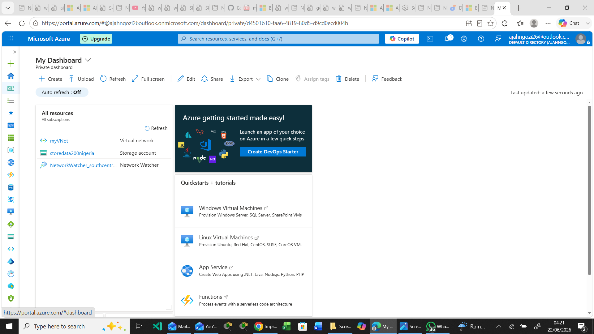
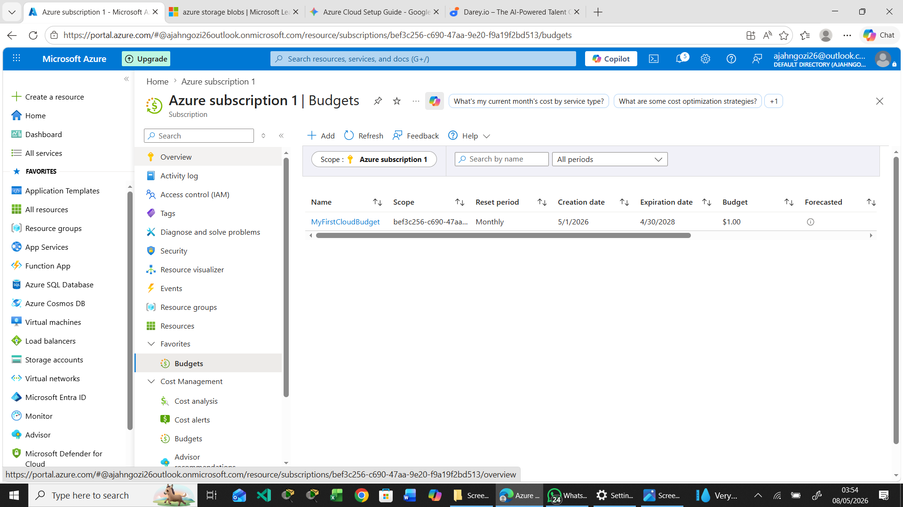

# Technical Report: Azure Free Tier Provisioning and Cloud Governance Analysis

**Submitted By:** Ngozi Ajah  
**Date:** May 2026  
**Course/Platform:** Darey.io DevOps Track

---

## Section 1: Narrative of the Azure Free Tier Account Creation

This section documents the sequential workflow followed to provision, validate, and launch a Microsoft Azure Free Tier account.

### 1.1 Initialization and Account Authentication (Step 1)
The deployment process began by navigating to the official Azure Free Account registration portal. To establish the new cloud tenant, a primary Microsoft account was authenticated under the profile email `ajahngozi26@outlook.com` and registered under the legal name **Ngozi Ajah**. 

The contact and notification routing configuration details are summarized below:

| Profile Attribute | Value | Purpose |
| :--- | :--- | :--- |
| **Primary Account** | `ajahngozi26@outlook.com` | Primary identity and tenant owner |
| **Legal Name** | Ngozi Ajah | Account holder identification |
| **Primary Mobile Number** | `08064418330` | Core verification and multi-factor auth |
| **Secondary Email** | `ajahngozi450@gmail.com` | Notification routing and communication defaults |

A secondary identity verification check was successfully cleared via a one-time password (OTP) sent directly to the primary mobile device.

### 1.2 Identity and Address Verification: "About You" (Step 2)
Following initial account authentication, structural identity and physical location details were documented to satisfy regional tenant rules. The operational, residential, and billing address was captured as follows:

* **Address Line 1:** 1 Gwani Street, Wuse Zone 4, Abuja
* **Address Line 2:** Wuse Zone 4
* **City:** ABUJA
* **Postal Code:** `900284`
* **State/Region:** NIGERIA FEDERAL CAPITAL TERRITORY

> ⚠️ **Technical Resolution Note:** During this step, the automated Azure system flagged an address validation warning stating:  
> *"We couldn't validate your address. Please ensure the address you've entered is correct."* > To circumvent this validation loop and proceed with the deployment, the manual override option **"Use this address"** was explicitly selected, forcing the system to accept the structural tenant details.

### 1.3 Financial Validation and Finalization (Step 3)
To deter automated registrations and securely verify identity, a valid physical financial instrument was submitted to the system during the final phase of identity verification:

* **Card Provider:** First Bank of Nigeria
* **Card Type:** MasterCard
* **Card Number (Masked):** `xxxx-xxxx-xxxx-0278`
* **Expiration Date:** `12/28`

A temporary micro-charge authorization hold was placed on the card by Microsoft to confirm validity. The billing interface explicitly stated that this transaction was strictly for identity validation, and no actual charges would be incurred during the trial period unless the account is manually upgraded to a "Pay-As-You-Go" subscription model. 

The registration concluded by accepting the terms and conditions of the **Microsoft Customer Agreement**, granting immediate access to the Azure Portal (`portal.azure.com`).

### 1.4 Credit Provisioning and Allocation
Upon successful tenant activation, Microsoft provisioned a **$200 USD Free Credit** allocation to the account. This credit allocation is strictly bound by the following compliance guardrails:
* **Usage Limit:** Max $200 USD equivalent.
* **Time Horizon:** Limited to a **30-day (1-month) usage window**, after which any unspent credit expires.

 ### 1.5 Azure Portal Navigation & Workspace Customization

### Portal Navigation Guide
Navigating the Azure Portal efficiently relies on three foundational interface components:
* **Global Search Bar (Top Center):** The primary entry point for resource location. Entering strings such as "Storage accounts" or "Microsoft Entra ID" provides instantaneous access to services, resource instances, and documentation.
* **The 'All Services' Menu:** Accessed via the hamburger icon (top-left corner). This menu aggregates all available cloud services categorized by functional domains (Compute, Networking, Storage, etc.).
* **Breadcrumbs:** Located dynamically below the global navigation bar, breadcrumbs establish a tracking path (e.g., *Home > Resource Groups > MyResourceGroup*), allowing seamless upward directory traversal.

### Custom Dashboard Configuration
To streamline environment monitoring, a customized operational dashboard was provisioned:
1. Navigated to the Azure Portal **Dashboard** hub and selected **Create > Custom Dashboard**.
2. Deployed functional tiles for resource monitoring, including pinning **Resource Groups** and specific **Storage Accounts** for visibility.
3. Configured layout configurations to prioritize active resource health.

---

## Section 2: Architectural and Governance Summary Report

### 2.1 Regional Deployment Strategy
For the initial deployment of cloud resources, the **`East US`** region was selected. 

This decision was driven by an analysis of technical and compliance factors:
1. **Network Latency:** Offered optimal network latency profiles relative to the local testing environment.
2. **Data Residency:** Maintained strict alignment with testing framework compliance regulations.
3. **Feature Availability:** Ensured comprehensive availability for all Azure Free Tier eligible resources, specifically B-series burstable virtual machines and standard cloud storage.

  ### 2.2 Billing, Cost Management, and Free Tier Limits

While the Azure Free Tier provides a $200 credit window for 30 days, proactive cost governance is essential. To enforce financial guardrails, a budget threshold alert was explicitly configured:
1. Accessed the **Cost Management + Billing** console.
2. Selected **Budgets** and defined a baseline budget corresponding to the promotional limit.
3. Configured an automated **Alert Condition** set at **75% of the total budget threshold** (Actual cost trigger). 
4. Assigned notification channels to alert engineering personnel immediately upon crossing the threshold.

#### Free Tier Limits & Resource Allocation Matrix
To ensure compliance with structural free tier limits and avoid unexpected service degradation or invoicing, the following matrix details resource boundaries:

| Service Category | 12 Months Free Allocation | Always Free Baseline |
| :--- | :--- | :--- |
| **Compute** | 750 Hours of B1s Burstable VMs (Windows or Linux) | *None* |
| **Storage** | 5 GB LRS Block Blob Storage + 5 GB File Storage | *None* |
| **Databases** | 250 GB Azure SQL Database | 25 GB Cosmos DB (1,000 RU/s) |
| **Developer Tools** | *None* | Azure DevOps (Up to 5 users), App Service (10 Web/Mobile Apps) |
| **Networking** | 15 GB Outbound Data Transfer | *None* |

#### Practical Identity Security Posture
Supplementing the theoretical Shared Responsibility Model, practical identity controls were initialized to secure the root administration layer:
* **Multi-Factor Authentication (MFA):** Enforced tenant-wide by configuring Microsoft Entra ID Security Defaults. This mandates MFA via the Microsoft Authenticator app for all administrative workflows, blocking credential-stuffing threat vectors.
* **Password Policy:** Implemented strict character restrictions during identity creation, enforcing a minimum 12-character alphanumeric complexity framework.

### 2.2.1 Practical Identity Security Posture
Supplementing the theoretical Shared Responsibility Model, practical identity controls were initialized to secure the root administration layer:
* **Multi-Factor Authentication (MFA):** Enforced tenant-wide by configuring Microsoft Entra ID (formerly Azure Active Directory) Security Defaults. This mandates MFA via the Microsoft Authenticator app for all administrative workflows, blocking credential-stuffing threat vectors.
* **Password Policy:** Implemented strict character restrictions during identity creation, enforcing a minimum 12-character alphanumeric complexity framework.
* **Trusted Devices:** Administrative portal authentication sessions are bound to verified devices, restricting root-level changes from unauthenticated geographic coordinates.
---

### 2.3 Analysis of the Shared Responsibility Model
When deploying an Infrastructure as a Service (IaaS) resource, such as an Azure Virtual Machine, a clear delineation of operational boundaries occurs between the cloud provider (Microsoft) and the customer.
┌─────────────────────────────────────────────────────────────┐
│             Shared Responsibility Matrix (IaaS)             │
├──────────────────────────────┬──────────────────────────────┤
│    Managed by MICROSOFT      │      Managed by CUSTOMER     │
├──────────────────────────────┼──────────────────────────────┤
│ 🖥️ Physical Datacenters       │ 🐧 Guest Operating System    │
│ ⚡ Power & Cooling            │ 🔄 System OS Patching        │
│ 🛡️ Hypervisor Layer           │ 🧱 Firewall Rules (NSGs)     │
│ 🔌 Physical Network/Fabric   │ 🔑 Identity & Access (RBAC)  │
│ 💾 Hardware Infrastructure   │ 📦 Application & Data Layer  │
└──────────────────────────────┴──────────────────────────────┘
* **Physical and Infrastructure Security:** *Microsoft Responsibility.* Microsoft maintains exclusive responsibility for the physical datacenters within the chosen region. This encompasses physical access controls, power redundancy, environmental cooling, and underlying hardware maintenance.
* **Virtualization Fabric:** *Microsoft Responsibility.* Microsoft is responsible for managing and securing the hypervisor layer, ensuring logical isolation and robust security boundaries between the virtual machine and other cloud tenants.
* **Guest Operating System:** *Customer Responsibility.* Responsibility was assumed for the guest operating system (e.g., Ubuntu/Windows). This requires the DevOps engineer to manage system patches, execute kernel updates, and remediate OS-level vulnerabilities.
* **Network Access Control:** *Shared Framework / Customer Implementation.* While Microsoft provisions the underlying Network Security Group (NSG) framework, the implementation of specific firewall rules—such as restricting SSH (Port 22) or HTTP (Port 80) access—remains entirely the customer's duty.
* **Identity and Access Management:** *Customer Responsibility.* Responsibility was held for securing access to the infrastructure. This involves configuring strict password policies, maintaining SSH keys, and utilizing Azure Role-Based Access Control (RBAC) to enforce the principle of least privilege.
* **Data and Application Layer:** *Customer Responsibility.* Complete ownership was retained over the applications (such as Nginx or Apache) and data housed within the virtual instance. Ensuring proper encryption, secure coding practices, and data backup routines is a 100% customer-managed task.
---

### 2.4 Conclusion
The deployment successfully demonstrated that while Microsoft guarantees the integrity, availability, and security of the underlying physical and virtualization infrastructure, the DevOps engineer remains fully accountable for securing the operational environment, network access rules, and data payloads hosted within that environment.

### 2.5 Troubleshooting
* **Issue: Credit alert email not received.**
  * *Fix:* Check Spam/Junk folders and verify that the email address entered in the Budget Alert configuration is spelled correctly.
* **Issue: Cannot provision a B1s VM.**
  * *Fix:* Ensure you are selecting a supported region (like East US or West Europe) where the B1s sizes are available under the free tier.
    

### 2.6 Next Steps Checklist
- [ ] Monitor the $200 credit balance weekly via the Cost Management dashboard.
- [ ] Clean up/delete resources (Storage accounts, resource groups) before the 30-day trial expires to avoid automated billing.
- [ ] Set up a secondary IAM User with restrictive permissions for daily tasks instead of using the Root account.

